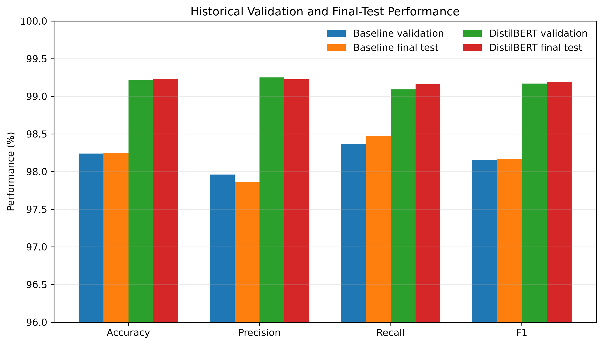
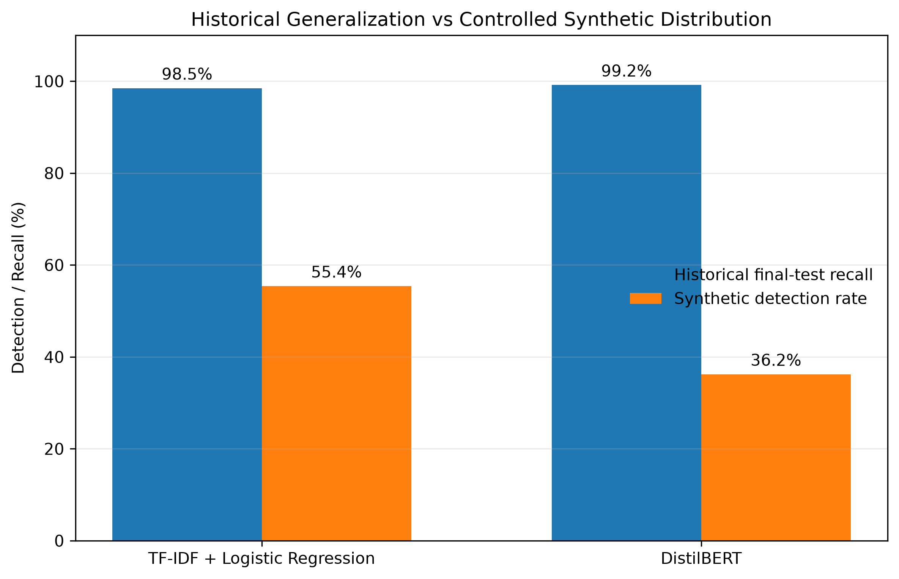
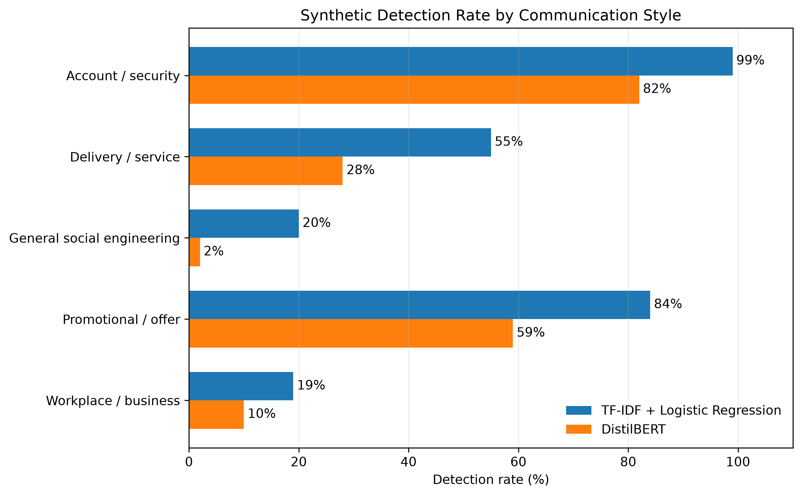
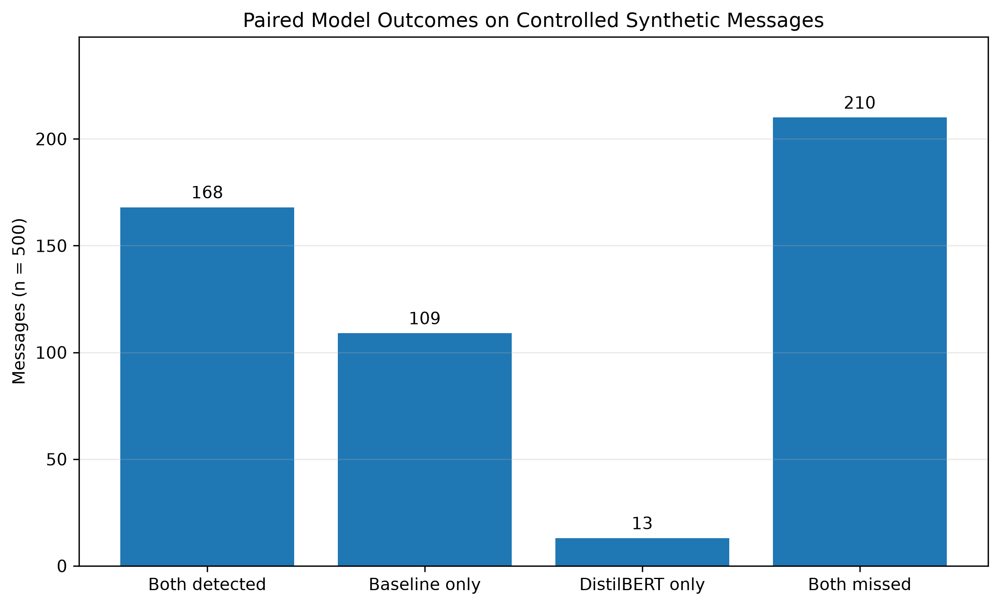
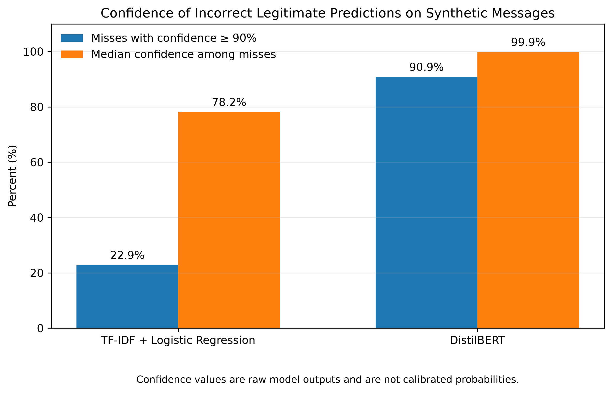

# Evaluating Phishing Email Classifiers Under Controlled Synthetic Distribution Shift

## Abstract

This study investigates whether machine-learning and Natural Language Processing models can distinguish phishing-class email content from legitimate email content while maintaining a low false-positive rate, and whether controlled controlled synthetic phishing-class messages are more difficult to detect than traditional phishing-class messages.

Two classifiers were developed and compared: a TF-IDF + Logistic Regression baseline and a fine-tuned DistilBERT transformer model. Both were trained using a large historical email dataset assembled from multiple public corpora. After reproducible cleaning and deduplication, the dataset contained 208,161 emails and was divided into training, validation, and isolated test partitions.

On the traditional validation distribution, both models performed strongly. The baseline achieved 98.24% accuracy, 98.37% phishing recall, and a 1.87% false-positive rate. DistilBERT improved validation performance to 99.21% accuracy, 99.09% phishing recall, and a 0.68% false-positive rate. After model development was complete, the previously isolated 31,225-email historical test set was consumed exactly once. Test performance closely reproduced validation performance: the baseline achieved 98.25% accuracy and 98.47% recall, while DistilBERT achieved 99.23% accuracy and 99.16% recall.

A separate frozen evaluation set of 500 controlled controlled synthetic phishing-class messages was then used to examine robustness under distribution shift. The baseline detected 55.4% of these messages, while DistilBERT detected 36.2%. DistilBERT also produced many high-confidence incorrect legitimate predictions. The strongest performance differences appeared across communication styles rather than simple message length or generator source. Security-oriented messages were detected much more frequently than routine workplace and general social-engineering messages.

The results show that strong in-distribution validation performance does not necessarily imply robustness to a substantially different synthetic email distribution. They also show that a more complex transformer model can outperform a simpler baseline on familiar data while degrading more sharply under distribution shift.

---

## 1. Introduction

Phishing remains a major cybersecurity problem because attacks often target the human user rather than only the technical infrastructure surrounding that user. A successful phishing message can attempt to persuade a recipient to follow a malicious link, disclose sensitive information, open an attachment, or take another unsafe action.

Recent generative AI systems can produce fluent and natural-sounding text quickly. This creates a defensive research question: if phishing-style messages become more polished, varied, or contextually natural, will existing machine-learning detectors remain reliable?

This project studies that problem at the human communication layer. The goal is not to generate operational phishing campaigns or optimize evasion. Instead, the project evaluates defensive classifiers using historical phishing-class email data and a controlled set of synthetic, non-operational phishing-class messages.

The study compares a traditional sparse-text baseline with a transformer-based NLP model. It also emphasizes robustness analysis rather than relying only on standard validation accuracy.

---

## 2. Related Work

### 2.1 NLP and Machine Learning for Phishing Email Detection

Phishing-email detection has a substantial history in Natural Language Processing and machine learning. Salloum et al. surveyed NLP-based phishing-email detection research and found that machine-learning approaches commonly rely on lexical, structural, and statistical properties of messages to distinguish malicious from legitimate email [1]. Their review also emphasized that phishing detection remains an evolving problem rather than a solved binary-classification task.

This prior literature motivates the use of a transparent classical baseline in the present study. TF-IDF combined with a linear classifier provides a useful reference point because it exposes which lexical features contribute strongly to decisions while remaining computationally inexpensive. A central question in this project is not simply whether such a baseline can achieve high accuracy, but whether its learned patterns remain useful when the writing distribution changes.

### 2.2 Contextual Transformer Models

BERT introduced bidirectional transformer pre-training that can be fine-tuned for downstream text-classification tasks using contextual representations rather than only sparse lexical features [2]. DistilBERT was subsequently proposed as a compressed BERT-family model using knowledge distillation. Sanh et al. reported that DistilBERT reduced model size by approximately 40% while retaining most of BERT's language-understanding performance and improving inference efficiency [3].

These properties make DistilBERT a useful advanced comparison for phishing-email classification. Unlike TF-IDF, it can represent words in context and capture relationships across a sequence. The present study therefore compares a sparse lexical model with a contextual transformer under the same dataset split and evaluation framework.

### 2.3 Transformer and LLM-Based Phishing Detection

Recent work has increasingly applied transformer architectures to phishing detection. Uddin, Mahiuddin, and Sarker evaluated a fine-tuned RoBERTa model for phishing-email classification and reported 98.45% accuracy while also using explainability methods to inspect model decisions [4]. This supports the broader finding that transformer-based representations can perform strongly on phishing-email benchmarks.

At the same time, strong benchmark accuracy does not by itself establish robustness to new writing distributions. Much of the published phishing-detection literature evaluates models on train/test partitions drawn from the same or closely related corpora. This project extends that evaluation perspective by separating ordinary held-out historical generalization from a controlled synthetic distribution-shift experiment.

### 2.4 Generative AI and Phishing

Generative AI changes both the offensive and defensive sides of phishing research. Eze and Shamir constructed and analyzed a corpus of controlled synthetic phishing-class messages and reported that AI-generated phishing displayed stylistic differences from human-generated scam email, arguing that future defensive systems should account for AI-generated content during model development [5].

A 2026 systematic review by Sivaneswaran et al. examined 36 studies involving LLMs in phishing generation and detection. The review found that LLM research has expanded both the ability to generate coherent phishing content and the ability to build more context-aware defensive systems; it also noted that many studies rely on manually generated datasets rather than standardized public benchmarks [6].

Human-subject research further suggests that simple LLM-assisted personalization can produce socially convincing deceptive messages. Francia et al. compared GPT-4-generated and human-authored personalized smishing messages in a controlled 25-target pilot study. They found that the observed intended-click rate was higher for the GPT-4 condition, although the difference was statistically uncertain, and participants could not reliably identify message authorship better than chance [7]. That work concerns SMS rather than email and does not directly measure classifier robustness, but it reinforces the importance of evaluating defensive systems on natural and varied communication styles rather than assuming that AI-generated malicious text will contain obvious surface cues.

### 2.5 Confidence Under Distribution Shift

The confidence behavior of neural classifiers is also relevant to this study. Guo et al. showed that modern neural networks can be poorly calibrated, meaning predicted confidence does not necessarily correspond to empirical correctness [8]. Ovadia et al. later demonstrated that predictive uncertainty can deteriorate further under dataset shift, emphasizing that high model confidence should not automatically be treated as evidence that an out-of-distribution prediction is trustworthy [9].

These findings provide important context for the confidence analysis in this project. The synthetic experiment does not assume that softmax probability is a calibrated real-world probability. Instead, confidence is analyzed descriptively to determine whether the model becomes uncertain when it fails under the controlled distribution shift.

### 2.6 Research Gap Addressed in This Study

The literature establishes that classical NLP methods, transformer models, and LLM-based systems can all perform strongly in phishing-related tasks. It also establishes that generative AI can alter phishing language and that neural confidence can become unreliable under distribution shift.

A gap directly relevant to this project is the need to evaluate the **same frozen phishing classifiers across both an untouched in-distribution test set and a separately constructed synthetic out-of-distribution set**, while also examining error overlap, message style, input length, source artifacts, and confidence behavior.

The present study is designed around that distinction. It does not attempt to prove that its synthetic set represents all AI-generated phishing. Instead, it asks whether models that generalize strongly to unseen historical emails retain that performance when evaluated on a controlled writing distribution that differs substantially from their training data.

---

## 3. Research Questions

### Primary Research Question

**How accurately can machine-learning and Natural Language Processing models distinguish phishing-class from legitimate historical emails while maintaining a low false-positive rate, and how robust are those frozen classifiers to a controlled synthetic phishing-class distribution?**

### Secondary Research Question

**How does detection performance on controlled synthetic phishing-class messages compare with performance on held-out historical phishing-class emails?**

### Hypothesis

The initial hypothesis was that NLP-based machine-learning models would distinguish phishing-class from legitimate email using language and structural patterns, but that controlled controlled synthetic phishing-class messages could be more difficult to detect because they may use more fluent and less stereotypical language.

A second expectation was that DistilBERT could outperform the TF-IDF + Logistic Regression baseline on standard validation data because it can represent contextual language patterns that sparse bag-of-words features cannot capture directly.

---

## 4. Dataset

### 4.1 Historical Email Dataset

The primary dataset was the **Phishing-Email-Detection-Dataset**, published on Zenodo by Alhuzali, Alloqmani, Aljabri, and Alharbi [10] and associated with the repository:

https://github.com/Manar-ibr/Phishing-Email-Detection-Dataset

Zenodo DOI:

https://doi.org/10.5281/zenodo.17314806

The merged dataset combines several historical email corpora, including sources such as:

- Enron;
- SpamAssassin;
- TREC 2005, 2006, and 2007;
- CEAS;
- Nazario;
- Nigerian scam collections;
- other merged email sources included by the dataset authors.

The positive class is broader than narrowly defined credential phishing. Spam, scam, and phishing-related content are grouped into the phishing class in the merged source.

### 4.2 Raw Dataset Inspection

The raw merged dataset contained:

- 213,189 rows;
- 113,192 rows labeled 0;
- 99,225 rows labeled 1;
- 772 missing labels;
- 620 missing email bodies;
- 624 whitespace-only bodies;
- 4,896 exact duplicate rows;
- 7,921 rows participating in duplicate-body groups.

The email-length distribution was highly skewed. The median message length was 789 characters, while a small number of records were extremely large. Long emails were not automatically deleted solely because of length.

### 4.3 Cleaning

Cleaning was performed programmatically so the process could be reproduced.

Rows were removed when they contained:

- missing required values;
- empty or whitespace-only text;
- unexpected labels;
- exact duplicate email bodies.

The final cleaned dataset contained:

- **208,161 emails**
- **108,953 legitimate**
- **99,208 phishing-class**

Class distribution:

- legitimate: 52.34%;
- phishing-class: 47.66%.

The cleaned dataset retained its natural class distribution rather than being manually balanced.

### 4.4 Train, Validation, and Test Split

A stratified split using random seed 42 produced:

| Partition | Total | Legitimate | Phishing-class |
| --- | ---: | ---: | ---: |
| Training | 145,712 | 76,267 | 69,445 |
| Validation | 31,224 | 16,343 | 14,881 |
| Test | 31,225 | 16,343 | 14,882 |

Exact duplicate email bodies were checked across partitions, and no duplicate bodies were present between the training, validation, and test sets.

The test set was intentionally isolated during model development, validation-based model selection, robustness analysis, and synthetic evaluation. After all model-development decisions were frozen, it was consumed exactly once for final evaluation. No post-test tuning was permitted.

---

## 5. Exploratory Data Analysis

Formal exploratory analysis was performed using the training partition only.

Class balance was:

- 52.34% legitimate;
- 47.66% phishing-class.

Median character lengths:

- legitimate: 1,046 characters;
- phishing-class: 570 characters.

Median word counts:

- legitimate: 163 words;
- phishing-class: 90 words.

The 99th percentile training message length was approximately 13,554 characters.

These differences indicated that message length contained some predictive information, but later robustness experiments showed that length alone was not sufficient to explain the model results.

---

## 6. Baseline Model

### 6.1 Model Design

The baseline classifier used:

- TF-IDF text features;
- unigrams and bigrams;
- lowercasing;
- Unicode accent normalization;
- minimum document frequency of 2;
- maximum document frequency of 0.995;
- maximum feature count of 200,000;
- sublinear term-frequency scaling;
- Logistic Regression using the `liblinear` solver;
- random seed 42.

### 6.2 Validation Results

The baseline produced:

| Metric | Result |
| --- | ---: |
| Accuracy | 98.24% |
| Precision | 97.96% |
| Recall | 98.37% |
| F1 | 98.16% |
| False-positive rate | 1.87% |
| False-negative rate | 1.63% |

Confusion matrix:

- true negatives: 16,038;
- false positives: 305;
- false negatives: 243;
- true positives: 14,638.

Total validation errors: **548**.

### 6.3 Baseline Interpretation

The highest positive-weight features included terms such as:

- `your`;
- `our`;
- `http`;
- `money`;
- `info`;
- `com`.

The strongest negative-weight features included terms such as:

- `wrote`;
- `thanks`;
- `enron`;
- `edu`.

This raised a possible concern that the classifier could be learning historical corpus or source-specific cues rather than only general phishing semantics.

That concern motivated additional robustness experiments.

---

## 7. Baseline Robustness Experiments

### 7.1 Artifact Removal

A stronger artifact-removal evaluation removed or masked obvious source-related markers such as years, numeric patterns, and recognizable corpus artifacts.

The resulting validation metrics were:

| Metric | Artifact-removed result |
| --- | ---: |
| Accuracy | 98.20% |
| Precision | 97.92% |
| Recall | 98.30% |
| F1 | 98.11% |
| False-positive rate | 1.90% |

The small change from the original baseline suggests that the classifier's performance was not explained only by a small set of obvious source markers.

### 7.2 Length-Only Classifier

A separate classifier using message length as the main predictive signal produced:

| Metric | Result |
| --- | ---: |
| Accuracy | 59.92% |
| Precision | 57.07% |
| Recall | 64.11% |
| F1 | 60.39% |

This demonstrated that length contains signal, but it is not sufficient to explain the approximately 98% validation accuracy of the full TF-IDF baseline.

---

## 8. DistilBERT Model

### 8.1 Training Configuration

The advanced NLP model used **DistilBERT base uncased** [3].

Training settings included:

- maximum input length: 256 tokens;
- training batch size: 16;
- evaluation batch size: 32;
- epochs: 2;
- learning rate: 2e-5;
- weight decay: 0.01;
- model selection based on validation F1;
- FP16 training;
- random seed 42.

Training was performed using an NVIDIA Tesla T4 environment.

### 8.2 Validation Results

DistilBERT produced:

| Metric | Result |
| --- | ---: |
| Accuracy | 99.21% |
| Precision | 99.25% |
| Recall | 99.09% |
| F1 | 99.17% |
| False-positive rate | 0.68% |
| False-negative rate | 0.91% |

Confusion matrix:

- true negatives: 16,232;
- false positives: 111;
- false negatives: 135;
- true positives: 14,746.

Total validation errors: **246**.

### 8.3 Comparison with Baseline

Compared with the baseline, DistilBERT achieved:

- +0.97 percentage points accuracy;
- +1.01 percentage points F1;
- approximately 63.6% relative reduction in false positives;
- approximately 44.2% relative reduction in false negatives;
- 302 fewer validation errors overall.

On the traditional validation distribution, DistilBERT was the stronger classifier.

---

## 9. Transformer Error Analysis

### 9.1 Error Counts

DistilBERT made:

- 111 false positives;
- 135 false negatives;
- 246 total errors.

Median false-positive message size:

- 902 characters;
- 123 words.

Median false-negative message size:

- 1,333 characters;
- 198 words.

### 9.2 Error Confidence

Among the 246 DistilBERT validation errors:

- 206 were made with at least 90% confidence;
- 131 were made with at least 99% confidence;
- only 9 were made with less than 60% confidence.

This showed that many incorrect predictions were not merely borderline cases.

### 9.3 Context-Length Investigation

Token-length analysis showed that some errors exceeded the 256-token cutoff, especially false negatives.

A robustness evaluation reused the same trained model but increased inference length from 256 to 512 tokens.

Results changed only slightly:

| Metric | 256 tokens | 512 tokens |
| --- | ---: | ---: |
| Accuracy | 99.21% | 99.22% |
| Precision | 99.25% | 99.23% |
| Recall | 99.09% | 99.13% |
| F1 | 99.17% | 99.18% |

Only 45 of 31,224 predictions changed.

Twenty-four previous errors were corrected, while 21 previously correct predictions became incorrect.

Therefore, truncation contributed to some errors but was not the primary explanation for the remaining model failures.

---

## 10. Model Error Overlap

The baseline and DistilBERT predictions were compared directly on the validation set.

Results:

- both correct: 30,556;
- both wrong: 126;
- baseline wrong and DistilBERT correct: 422;
- baseline correct and DistilBERT wrong: 120.

DistilBERT corrected approximately 77.0% of baseline errors.

However, approximately 51.2% of DistilBERT errors were also missed by the baseline.

The two models therefore learned overlapping but not identical decision patterns.

Shared hard cases contained heavily overlapping surface vocabulary, suggesting that no single keyword explained the difficult examples.

---

## 11. Final Held-Out Historical Test Evaluation

### 11.1 One-Shot Protocol

After model development was complete, the frozen TF-IDF + Logistic Regression baseline and frozen DistilBERT model were evaluated once on the previously untouched historical test split.

The test artifact contained 31,225 emails:

- 16,343 legitimate;
- 14,882 phishing-class.

Before evaluation, the exact test file and frozen model artifacts were fingerprinted with SHA-256 hashes. The test set was then declared consumed. No hyperparameter tuning, retraining, threshold adjustment, calibration fitting, feature selection, or model selection is permitted using these results.

The complete artifact hashes and evaluation record are preserved in `documentation/final_test_evaluation.md`.

### 11.2 Final Test Results

| Metric | TF-IDF + Logistic Regression | DistilBERT |
| --- | ---: | ---: |
| Accuracy | **98.2482%** | **99.2314%** |
| Precision | **97.8631%** | **99.2267%** |
| Recall | **98.4747%** | **99.1601%** |
| F1 | **98.1679%** | **99.1934%** |
| False-positive rate | **1.9580%** | **0.7037%** |
| False-negative rate | **1.5253%** | **0.8399%** |
| True negatives | 16,023 | 16,228 |
| False positives | 320 | 115 |
| False negatives | 227 | 125 |
| True positives | 14,655 | 14,757 |
| Total errors | **547** | **240** |

### 11.3 Validation-to-Test Generalization

| Metric | Baseline Validation | Baseline Test | DistilBERT Validation | DistilBERT Test |
| --- | ---: | ---: | ---: | ---: |
| Accuracy | 98.24% | 98.25% | 99.21% | 99.23% |
| Precision | 97.96% | 97.86% | 99.25% | 99.23% |
| Recall | 98.37% | 98.47% | 99.09% | 99.16% |
| F1 | 98.16% | 98.17% | 99.17% | 99.19% |
| False-positive rate | 1.87% | 1.96% | 0.68% | 0.70% |
| False-negative rate | 1.63% | 1.53% | 0.91% | 0.84% |

Both frozen models reproduced their validation performance closely on previously unseen historical examples. DistilBERT made 240 test errors compared with 246 validation errors, while the baseline made 547 test errors compared with 548 validation errors.

**Figure 1. Historical validation and final-test performance.** Validation and final-test results remain closely aligned for both frozen models, supporting strong same-distribution generalization before the separate synthetic robustness evaluation.

This distinction is important for the later robustness experiment. The models did not simply fail whenever they encountered unseen email. They generalized strongly to unseen data drawn from the same historical distribution, but their performance declined sharply on the separately constructed synthetic distribution.

### 11.4 Baseline Serialization Limitation

The frozen baseline artifact had been serialized under scikit-learn 1.9.1 and was evaluated in an environment using scikit-learn 1.6.1, producing `InconsistentVersionWarning` messages. A previously verified compatibility adjustment restored the missing `multi_class` attribute without changing learned coefficients or retraining the model. The compatibility-loaded artifact reproduced the original validation metrics exactly before the test set was consumed.

This environment mismatch is retained as a reproducibility limitation rather than hidden. Future model artifacts should be preserved together with an exact pinned training environment.

---

## 12. Controlled AI-Generated Phishing-Class Evaluation

### 12.1 Purpose

The main robustness experiment asked whether models trained on historical email corpora would maintain their performance on a substantially different synthetic email distribution.

A separate dataset of 500 controlled synthetic phishing-class messages was created before either classifier was run on it.

The dataset was frozen before model exposure so the messages could not be edited in response to classifier performance.

### 12.2 Dataset Structure

Five communication categories were used:

1. account/security notification style;
2. workplace/business communication style;
3. delivery/service notification style;
4. promotional/offer style;
5. general social-engineering style.

Each category contained 100 messages.

Generation sources:

- Copilot: 250;
- Gemini: 250.

Each source contributed 50 messages to each category.

Metadata included:

- sample ID;
- category;
- text;
- label;
- generation source;
- generation date.

### 12.3 Safety Controls

The synthetic set was intentionally defensive and non-operational.

Messages did not contain:

- real targets;
- credential collection;
- malware;
- functional malicious attachments;
- real payment collection;
- real phishing infrastructure;
- deployable malicious links.

Placeholders such as `[LINK_REMOVED]` and `[ATTACHMENT_REMOVED]` were used where appropriate.

### 12.4 Quality Assurance

All 500 accepted samples were validated before model evaluation.

Final counts:

| Category | Count |
| --- | ---: |
| Account/security | 100 |
| Workplace/business | 100 |
| Delivery/service | 100 |
| Promotional/offer | 100 |
| General social engineering | 100 |

Generator totals:

- Copilot: 250;
- Gemini: 250.

Total: **500**.

One malformed generation batch was rejected and regenerated before classifier exposure. A metadata-only category-ID typo was corrected during assembly without changing the underlying message text.

---

## 13. Synthetic Evaluation Results

Because all synthetic samples belong to the positive phishing class, the main metric is **detection rate / recall**.

Precision and false-positive rate cannot be estimated meaningfully from this positive-only synthetic set.

### 13.1 Overall Results

| Model | Detected | Missed | Detection Rate | 95% Wilson CI |
| --- | ---: | ---: | ---: | ---: |
| Baseline | 277 | 223 | 55.4% | 51.0%-59.7% |
| DistilBERT | 181 | 319 | 36.2% | 32.1%-40.5% |

Both models degraded substantially relative to traditional validation recall.

The ordering also reversed:

- baseline traditional validation recall: 98.37%;
- DistilBERT traditional validation recall: 99.09%;
- baseline synthetic detection: 55.40%;
- DistilBERT synthetic detection: 36.20%.

**Figure 2. Historical generalization versus controlled synthetic detection.** Both models retain very high recall on the historical final test but decline substantially on the frozen positive-only synthetic set. Because the synthetic set contains only phishing-class examples, the plotted synthetic quantity is detection rate/recall rather than full classification accuracy.

### 13.2 Results by Category

| Category | Baseline | DistilBERT |
| --- | ---: | ---: |
| Account/security | 99% | 82% |
| Delivery/service | 55% | 28% |
| General social engineering | 20% | 2% |
| Promotional/offer | 84% | 59% |
| Workplace/business | 19% | 10% |

Both models performed best on account/security-style messages.

Both performed poorly on routine workplace/business and general social-engineering language.

**Figure 3. Synthetic detection rate by communication style.** Detection varied substantially across the five designed communication categories, with account/security messages detected most frequently and workplace/business and general social-engineering messages detected least frequently. These category differences are descriptive for this controlled dataset and should not be generalized to all AI-generated phishing.

### 13.3 Results by Generator

| Generator | Baseline | DistilBERT |
| --- | ---: | ---: |
| Copilot | 52.8% | 32.4% |
| Gemini | 58.0% | 40.0% |

Both classifiers detected Gemini-generated samples somewhat more often than Copilot-generated samples, but poor robustness occurred across both generation sources.

The generator difference was smaller than the communication-style differences.

---

## 14. Synthetic Prediction Overlap

The two classifiers were compared on the same 500 synthetic samples.

| Paired Outcome | Count | Percent |
| --- | ---: | ---: |
| Both detected | 168 | 33.6% |
| Both missed | 210 | 42.0% |
| Baseline only detected | 109 | 21.8% |
| DistilBERT only detected | 13 | 2.6% |

This means the baseline uniquely detected 109 messages, while DistilBERT uniquely detected 13.

The overlap pattern shows that DistilBERT was not completely redundant with the baseline, but the baseline had a much larger unique-detection advantage on this particular synthetic set.

The frozen evaluation set was not used to tune an ensemble because doing so would turn the evaluation data into development data.

**Figure 4. Paired model outcomes on the controlled synthetic set.** The largest paired group was messages missed by both models, followed by messages detected by both. The baseline uniquely detected substantially more messages than DistilBERT on this specific frozen set.

---

## 15. Statistical Comparison

Because both classifiers evaluated the exact same 500 messages, an exact two-sided McNemar test was used.

Paired outcomes:

- both correct: 168;
- baseline correct / DistilBERT wrong: 109;
- baseline wrong / DistilBERT correct: 13;
- both wrong: 210.

Discordant pairs: 122.

Continuity-corrected chi-square: 73.9754.

Exact two-sided p-value:

**4.678 × 10^-20**

Reported conventionally:

**p < 0.001**

Within this controlled synthetic evaluation set, the paired detection outcomes differed strongly between the models.

This result should not be interpreted as evidence that Logistic Regression is universally better than DistilBERT. The historical validation experiment showed the opposite ordering.

---

## 16. Synthetic Robustness Analysis

### 16.1 Message Length

Synthetic messages were short overall:

- median length: 193 characters;
- median length: 26 words.

Baseline:

- detected median: 189 characters / 25 words;
- missed median: 197 characters / 26 words.

DistilBERT:

- detected median: 186 characters / 25 words;
- missed median: 196 characters / 26 words.

Detected and missed messages had very similar lengths.

The synthetic messages were also far below the 256-token limit in typical cases.

Therefore, simple message length and transformer truncation are unlikely to explain the synthetic performance collapse.

### 16.2 Language Associations

For both models, higher detection was associated with recognizable account/security language such as:

- account;
- security;
- alert;
- profile;
- password;
- login.

Misses were more associated with routine organizational language such as:

- schedule;
- project;
- meeting;
- workspace;
- team;
- document;
- planning;
- revised.

These are descriptive associations within the synthetic dataset. They are not causal explanations and should not be interpreted as isolated trigger words.

### 16.3 Confidence

Baseline missed 223 messages.

Among those misses:

- 51 were predicted legitimate with at least 90% confidence;
- median miss confidence was 78.20%.

DistilBERT missed 319 messages.

Among those misses:

- 290 were predicted legitimate with at least 90% confidence;
- 233 were predicted legitimate with at least 99% confidence;
- median miss confidence was 99.92%.

DistilBERT therefore did not simply become uncertain under distribution shift. It was often extremely confident in incorrect legitimate classifications.

**Figure 5. Confidence behavior among synthetic misses.** DistilBERT produced a much larger share of high-confidence misses and a substantially higher median confidence among missed synthetic messages. These confidence values are raw model outputs and are not calibrated probabilities of real-world correctness.

### 16.4 High-Confidence Misses by Category

For DistilBERT:

| Category | Misses | At least 90% confident | Percent of misses |
| --- | ---: | ---: | ---: |
| Account/security | 18 | 13 | 72.2% |
| Delivery/service | 72 | 62 | 86.1% |
| General social engineering | 98 | 95 | 96.9% |
| Promotional/offer | 41 | 34 | 82.9% |
| Workplace/business | 90 | 86 | 95.6% |

The strongest high-confidence failures occurred in general social-engineering and workplace/business styles.

---

## 17. Discussion

The results separate two questions that can otherwise be conflated: whether a classifier generalizes to unseen examples from the historical data distribution, and whether it remains reliable after a substantial change in writing distribution.

### 17.1 Same-Distribution Generalization

Both frozen classifiers generalized consistently from validation to the previously untouched historical test set. DistilBERT retained its advantage over the TF-IDF + Logistic Regression baseline, reaching 99.23% test accuracy, 99.16% recall, and a 0.70% false-positive rate. The baseline reached 98.25% accuracy, 98.47% recall, and a 1.96% false-positive rate. The close agreement between validation and final-test metrics reduces the likelihood that the validation results were an isolated split-specific outcome.

This matters for interpreting the synthetic experiment. The later decline did not occur simply because the models encountered unseen messages. Both models had already demonstrated strong performance on unseen historical examples.

### 17.2 Controlled Synthetic Distribution Shift

Performance changed substantially on the separately frozen, positive-only set of 500 controlled synthetic phishing-class messages. Detection fell to 55.4% for the baseline and 36.2% for DistilBERT. The model ordering therefore reversed on this particular evaluation set despite DistilBERT's stronger historical performance.

The paired comparison strengthens the observation within this dataset: the baseline uniquely detected 109 messages, whereas DistilBERT uniquely detected 13. The exact McNemar test found a strong difference in paired outcomes (p < 0.001). This statistical result applies to the designed synthetic set and does not establish that the baseline would outperform DistilBERT across a broader population of AI-generated phishing.

A plausible interpretation is that DistilBERT learned representations that were highly effective for the historical distribution but transferred less effectively to the controlled synthetic distribution. The experiment does not identify a single causal mechanism, so the reversal should be treated as evidence of model-specific sensitivity to this distribution shift rather than proof of why that sensitivity occurred.

### 17.3 Communication Style and Failure Patterns

Detection varied more sharply across communication styles than across the two generation sources. Account/security messages were detected frequently by both classifiers, while workplace/business and general social-engineering messages were missed much more often. The associated vocabulary analysis showed the same descriptive pattern: recognizable security terminology appeared more often among detected messages, whereas routine organizational language appeared more often among misses.

Message length provides little evidence for an alternative explanation. Detected and missed synthetic messages had similar median lengths, and typical synthetic messages were well below DistilBERT's 256-token input limit. This makes simple length differences or truncation unlikely to account for the observed decline.

These patterns remain descriptive. The experiment was not designed to isolate individual words or communication styles as causal factors, and the controlled synthetic categories should not be treated as representative samples of all real phishing communication.

### 17.4 Confidence Under Shift

DistilBERT's confidence behavior is an additional concern. Of its 319 synthetic misses, 290 were predicted legitimate with at least 90% confidence and 233 with at least 99% confidence. Its median confidence among misses was 99.92%. The model therefore often failed without signaling uncertainty through its raw output score.

This result is consistent with prior work showing that neural-network confidence can be poorly calibrated and can become less reliable under dataset shift [8,9]. It does not mean that a 99% softmax score represents a 99% probability of correctness. Instead, the result shows that confidence thresholding alone would not have reliably identified many of the failures observed here.

### 17.5 Implications for Defensive Evaluation

Taken together, the experiments show why benchmark performance and robustness should be evaluated separately. DistilBERT was the stronger classifier on both historical validation and the untouched historical test set, yet it experienced the larger decline on the controlled synthetic distribution. The baseline was more robust on this specific synthetic set, but it also missed 44.6% of those messages.

The practical research implication is not that either architecture is universally preferable. Rather, defensive phishing classifiers should be tested across multiple independent distributions, communication styles, and time periods before strong claims about deployment reliability are made. High same-distribution accuracy, even when confirmed on a held-out test set, does not by itself establish robustness to materially different text distributions.

---

## 18. Defensive Prototype

A Streamlit application was developed to demonstrate how the DistilBERT model could be used as an interactive defensive prototype.

The user pastes email text into the interface.

The application displays:

- likely legitimate vs. potential phishing;
- phishing probability;
- legitimate probability;
- model information;
- a warning that confidence does not guarantee correctness.

The demo code is located at:

`Phase-1-Phishing-Detection/demo/phishing_detector_app.py`

The trained model is hosted at:

https://huggingface.co/ozuvadh/defensive-ai-phishing-distilbert

Three controlled interface checks were performed:

1. a routine legitimate message was classified as legitimate with approximately 100% legitimate probability;
2. a security-style phishing-class message was classified as phishing with 99.9% phishing probability;
3. a subtle workplace-style phishing-class message was incorrectly classified as legitimate with approximately 100% legitimate probability.

The third case is especially useful because it demonstrates a known failure mode rather than presenting only successful examples.

These three checks are demonstrations of prototype behavior, not a separate benchmark.

---

## 19. Limitations

This study has several important limitations.

### 19.1 Historical Dataset Age

Many source emails come from older corpora.

Language, email formatting, attack strategies, and normal user communication patterns have changed over time.

### 19.2 Broad Positive Class

The historical dataset groups multiple forms of spam, scams, and phishing into a broad positive class.

The resulting classifier is therefore not trained exclusively on narrowly defined credential-phishing examples.

### 19.3 Corpus Artifacts

Although explicit source-marker and length analyses were performed, historical corpus effects may still influence model behavior.

No artifact-removal experiment can prove the complete absence of dataset-source bias.

### 19.4 Synthetic Dataset Size

The synthetic evaluation contains only 500 messages.

It is large enough to reveal strong performance differences in this experiment, but it is not representative of every possible AI-generated phishing style.

### 19.5 Limited Generation Sources

Only two generation sources were included.

The findings should not be generalized to all generative models.

### 19.6 Positive-Only Synthetic Evaluation

All synthetic examples belong to the phishing class.

Therefore, the experiment estimates detection rate/recall but does not independently estimate synthetic-set false-positive rate or precision.

### 19.7 Controlled Safety Constraints

The synthetic messages were deliberately non-operational.

That improves research safety but also means they may differ from real malicious messages in ways that influence model behavior.

### 19.8 Confidence Calibration

DistilBERT showed severe overconfidence on many synthetic misses.

The classifier's raw softmax confidence should not be interpreted as a calibrated probability of real-world correctness, consistent with prior work showing that modern neural-network confidence can be miscalibrated and can degrade under distribution shift [8,9].

### 19.9 Statistical Generalization

Wilson intervals and McNemar testing describe uncertainty and paired differences within the designed evaluation framework.

Because the synthetic examples were controlled rather than randomly sampled from a defined population of all AI-generated phishing, the statistical results do not establish universal population-level performance.

---

## 20. Ethical and Safety Considerations

This project is designed exclusively for defensive cybersecurity research.

The work does not involve:

- real phishing campaigns;
- targeting real individuals;
- collecting credentials;
- unauthorized system access;
- malware deployment;
- operational social-engineering infrastructure.

Public historical datasets are used for model development.

Synthetic evaluation messages were generated under constraints intended to prevent them from becoming operational attack materials.

The purpose of the synthetic set is to evaluate detection robustness, not to improve phishing effectiveness.

The final prototype is also presented as a research system rather than a production security product.

---

## 21. AI Assistance and Researcher Role

AI tools were used during the project as research and development assistants.

Assistance included activities such as:

- code drafting and debugging;
- experiment planning;
- formatting;
- result organization;
- statistical calculation support;
- documentation drafting;
- generation of controlled synthetic evaluation messages.

The researcher selected the research question, dataset, evaluation design, models, experiment sequence, safety constraints, and interpretation goals; executed the experiments; reviewed outputs; preserved datasets and artifacts; and made decisions about what results to include.

Synthetic samples were frozen before classifier evaluation, and model results were not used to rewrite the accepted synthetic dataset.

Where a school, competition, publication, or other formal submission has its own AI-use disclosure requirements, those requirements should also be followed.

---

## 22. Reproducibility

The repository includes scripts for:

- dataset download;
- dataset inspection;
- data cleaning;
- train/validation/test splitting;
- exploratory analysis;
- baseline training;
- baseline interpretation;
- robustness checks;
- DistilBERT training;
- transformer error analysis;
- synthetic evaluation;
- statistical comparison;
- Streamlit demo inference.

Key files include:

- `src/prepare_dataset.py`
- `src/create_splits.py`
- `src/train_baseline.py`
- `src/analyze_baseline.py`
- `src/run_stronger_robustness_checks.py`
- `src/train_transformer.py`
- `src/analyze_transformer_errors.py`
- `src/evaluate_synthetic.py`
- `documentation/synthetic_evaluation_methodology.md`
- `documentation/synthetic_evaluation_results.md`
- `documentation/final_test_evaluation.md`
- `demo/phishing_detector_app.py`

The trained DistilBERT model is hosted separately because the weights are too large for a normal GitHub source file:

https://huggingface.co/ozuvadh/defensive-ai-phishing-distilbert

Raw large datasets and model artifacts are intentionally not committed directly to the source repository.

---

## 23. Conclusion

This study evaluated two phishing-email classifiers under both same-distribution historical testing and a separately constructed controlled synthetic distribution shift.

The TF-IDF + Logistic Regression baseline achieved 98.25% accuracy, 98.47% phishing-class recall, and a 1.96% false-positive rate on the previously untouched historical test set. DistilBERT achieved 99.23% accuracy, 99.16% recall, and a 0.70% false-positive rate. These results closely reproduced validation performance, providing evidence that both frozen models generalized strongly to unseen examples from the historical distribution.

Performance changed substantially on the separate positive-only set of 500 controlled synthetic phishing-class messages. The baseline detected 55.4% and DistilBERT detected 36.2%. Detection also varied sharply by designed communication style: account/security messages were detected frequently, while workplace/business and general social-engineering messages were missed much more often. DistilBERT additionally produced many incorrect legitimate classifications with very high raw confidence.

These synthetic results should be interpreted as a robustness stress test, not as an estimate of performance on the population of real-world AI-generated phishing. The controlled set used two generation sources, deliberate safety constraints, five designed communication categories, and only positive-class examples. It therefore demonstrates that the frozen classifiers were sensitive to this specific distribution shift without establishing how either model would perform across all contemporary or AI-assisted phishing.

The central finding is that strong held-out performance within a familiar data distribution does not by itself establish robustness to materially different text distributions. Evaluating defensive classifiers across independent datasets, writing styles, time periods, and distribution shifts is therefore important alongside conventional accuracy, recall, F1, and false-positive measurements.

Future work should evaluate additional independent holdouts, newer real-world email corpora, broader controlled generator coverage, and explicit confidence-calibration methods without reusing the consumed test or synthetic evaluation sets for model tuning. The broader Defensive AI Cybersecurity project will also extend this layered evaluation framework to the planned network-layer component.

---

## References

[1] S. A. Salloum, T. Gaber, S. Vadera, and K. Shaalan, "Phishing Email Detection Using Natural Language Processing Techniques: A Literature Survey," *Procedia Computer Science*, vol. 189, pp. 19-28, 2021. https://doi.org/10.1016/j.procs.2021.05.077

[2] J. Devlin, M.-W. Chang, K. Lee, and K. Toutanova, "BERT: Pre-training of Deep Bidirectional Transformers for Language Understanding," in *Proceedings of NAACL-HLT 2019*, pp. 4171-4186, 2019. https://doi.org/10.18653/v1/N19-1423

[3] V. Sanh, L. Debut, J. Chaumond, and T. Wolf, "DistilBERT, a distilled version of BERT: smaller, faster, cheaper and lighter," arXiv:1910.01108, 2019. https://arxiv.org/abs/1910.01108

[4] M. A. Uddin, M. Mahiuddin, and I. H. Sarker, "An explainable transformer-based model for phishing email detection: A large language model approach," *Computer Networks*, vol. 277, article 112061, 2026. https://doi.org/10.1016/j.comnet.2026.112061

[5] C. S. Eze and L. Shamir, "Analysis and Prevention of AI-Based Phishing Email Attacks," *Electronics*, vol. 13, no. 10, article 1839, 2024. https://doi.org/10.3390/electronics13101839

[6] D. Sivaneswaran, C. T. E. R. Hewage, H. M. K. K. M. B. Herath, R. S. Rathore, V. K. Singh, and W. Jiang, "A systematic literature review of large language models in phishing attack generation and detection," *Array*, vol. 30, article 100775, 2026. https://doi.org/10.1016/j.array.2026.100775

[7] J. Francia, D. Hansen, B. Schooley, M. Taylor, S. V. Murray, R. Cornelius, and G. Snow, "Assessing AI-Generated vs. Human-Authored Spear Phishing SMS Attacks: An Empirical Study," *Journal of Cybersecurity and Privacy*, vol. 6, no. 4, article 129, 2026. https://doi.org/10.3390/jcp6040129

[8] C. Guo, G. Pleiss, Y. Sun, and K. Q. Weinberger, "On Calibration of Modern Neural Networks," in *Proceedings of the 34th International Conference on Machine Learning*, PMLR 70, pp. 1321-1330, 2017. https://proceedings.mlr.press/v70/guo17a.html

[9] Y. Ovadia, E. Fertig, J. Ren, Z. Nado, D. Sculley, S. Nowozin, J. Dillon, B. Lakshminarayanan, and J. Snoek, "Can You Trust Your Model's Uncertainty? Evaluating Predictive Uncertainty Under Dataset Shift," in *Advances in Neural Information Processing Systems 32*, 2019. https://proceedings.neurips.cc/paper/2019/hash/8558cb408c1d76621371888657d2eb1d-Abstract.html

[10] A. Alhuzali, A. Alloqmani, M. Aljabri, and F. Alharbi, "Phishing-Email-Detection-Dataset," Zenodo, version 2, 2025. https://doi.org/10.5281/zenodo.17314806

